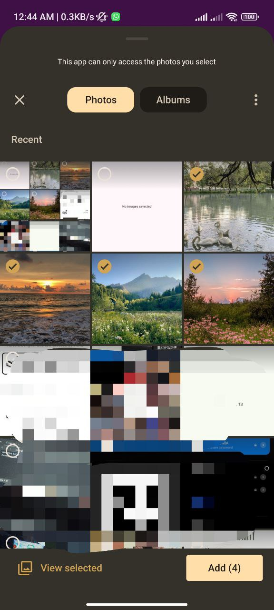

# Gallery Task

This Flutter app allows users to pick multiple images from their device's gallery and display them
in a ListView.

## Installation

1. Clone the repository.
2. Run `flutter pub get`.
3. Run the app using `flutter run`.

## Permissions

- **Android:** Add the following to `AndroidManifest.xml`:
  ```xml
  <uses-permission android:name="android.permission.READ_EXTERNAL_STORAGE"/>
  <uses-permission android:name="android.permission.WRITE_EXTERNAL_STORAGE"/>
  ```
- **iOS:** Add the following to `Info.plist`:
  ```xml
  <key>NSPhotoLibraryUsageDescription</key>
  <string>This app requires access to your photo library to select images.</string>
  ```

## Screenshot

## Screenshots

| Output                        | Pick Image                           | No Image                         |
|-------------------------------|--------------------------------------|----------------------------------|
|  |  |  |
